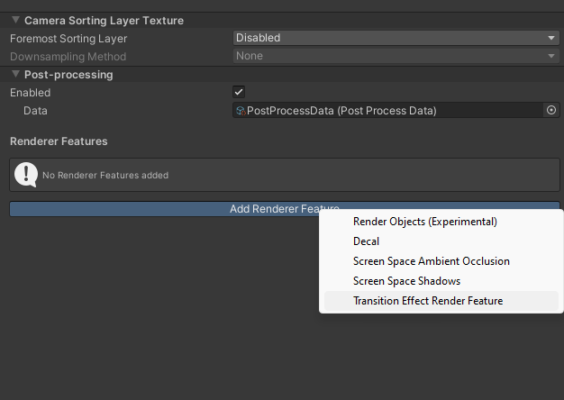

# Unity-Transition-Effects
URP Render Feature to do full-screen transition effects, like iris-wipes.


## Setup

### 1. Install The Package.

Go to Package Manager, and click "+", then "Add from git URL". Paste the following in:

```
https://github.com/hunterdyar/Unity-Transition-Effects.git
```

If you wish, click on the "Samples" tab and import the basic usage examples.

### 2. Add The Render Feature

First, Add the render feature to your URP Render settings. By Default for a 2D URP Project, these settings are Assets/Settings/Renderer2D.

At the bottom of the Renderer settings object is an "Add Renderer Feature" button. Select "Transition Effect Render Feature".



That's it. Now you're ready to use it!

### Settings Overview


The settings for the transition are stored right here.
- **Active** must be checked for the effect to be on. It's a convenient way to bypass an extra render pass when not needed, to minimize overhead. My utility coroutines turn this on and off, so be aware you may need to set it enabled if using your own code in addition to mine.
- **Transition Type** the type of visual transition. For the Circle transition, the "0-1" can be thought of as the radius of the circle. Transitions cannot be mixed together.
- **Transition** is a float where, at "0", the game will be visible, and at "1" the transition will cover the game entirely. We make a transition happen by smoothly sliding this value in a coroutine.
You can, and will likely, want to do this yourself.
- **Color** the RGB color of the circle. Alpha is ignored completely.

### 2. Usage.
The scriptable object settings are all editable at runtime. You can simply write a script that holds a reference to an serialized variable of type "TransitionEffectRenderFeature", and uses it's **SetTransition**, **SetColor**, **SetTransitionType**, and **SetActive** functions. You can assign the feature in the inspector from your renderer settings, and you're good to go. 

It's good practice to set SetActive to false when not transitioning. The performance impact may be negligible, but why do extra render passes when we know we don't need to? You don't need to use my UseActive, RenderFeatures can be disabled from code at runtime, but I find this a hassle.

But, there are a number of utility scripts to make your life easier, in the "Transition" class. The simplest example is as follows:

```c#
using Blooper.TransitionEffects;

public class FadeInOnStart : MonoBehaviour
{
    void Start()
    {
        StartCoroutine(Transition.TransitionInToScene(TransitionType.Fade,0.1f, 0.85f, Color.black));
    }
}
  
   
```

## Problems

### It does not go on top of the UI

If you have the ability, you can change your Canvas from "Screen Space - Overlay" to "**Screen Space - Camera**" (then assign the appropriate camera). For many users, this will work fine; and now the effect will happen on top of the UI.

If you have to use Overlay, then I can't help you. This is how the render features work. I don't really consider this a bug.

 